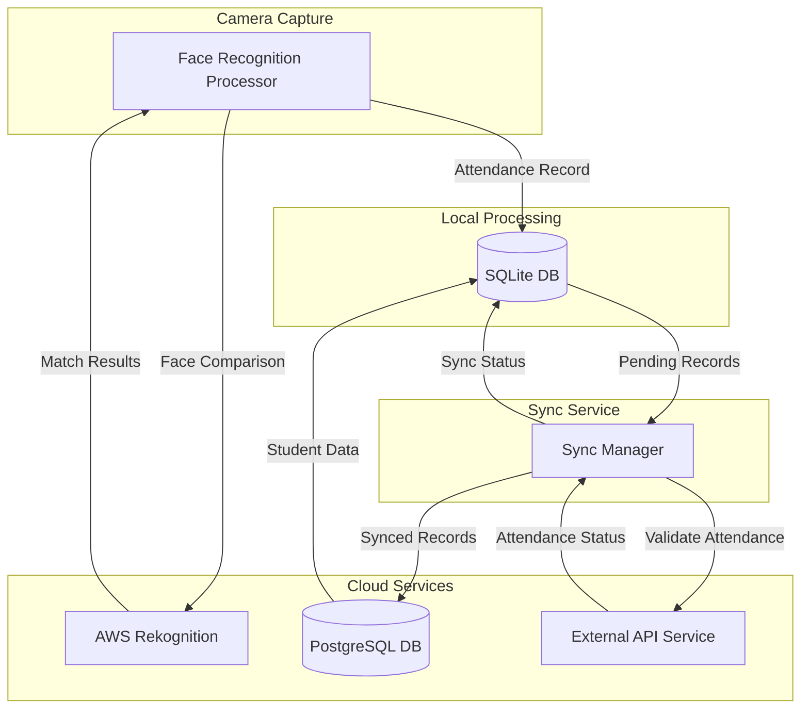

# Face Recognition Attendance System

A Python-based attendance tracking system that uses facial recognition to automatically register student attendance. The system operates in both online and offline modes, with local SQLite storage and cloud PostgreSQL synchronization.



## System Architecture

### Core Components

- Face Recognition Service: Uses AWS Rekognition for facial comparison
- Local Database (SQLite): Stores attendance records and student data for offline operation
- Cloud Database (PostgreSQL): Central database for attendance records
- External API Integration: Validates and processes attendance records
- Sync Service: Manages data synchronization between local and cloud storage

### Key Features

- Real-time face recognition using webcam
- Offline functionality with local storage
- Automatic synchronization when internet connection is available
- Duplicate attendance prevention
- Comprehensive logging and error handling
- Configurable settings via environment variables

## Technical Implementation

### Database Structure

- Students: Stores student information and face encodings
- Attendance Records: Tracks attendance with timestamps and confidence scores
- Sync Logs: Monitors synchronization status and errors
- Devices: Manages multiple capture devices

### Face Recognition Process

1. Captures frames from webcam
2. Compares captured faces with stored face encodings using AWS Rekognition
3. Records attendance when match confidence exceeds threshold
4. Prevents duplicate entries within configurable time window

### Synchronization Flow

1. Stores attendance records locally in SQLite
2. Periodically checks for internet connectivity
3. Syncs pending records to PostgreSQL when online
4. Validates attendance through external API
5. Updates sync status and logs

## Configuration

### Environment Variables

```env
POSTGRES_DB=attendance_db
POSTGRES_USER=postgres
POSTGRES_PASSWORD=changeme
POSTGRES_HOST=localhost
POSTGRES_PORT=5435

EXTERNAL_API_URL=http://localhost:8001/api
EXTERNAL_API_KEY=your-api-key

AWS_ACCESS_KEY_ID=your-aws-key
AWS_SECRET_ACCESS_KEY=your-aws-secret
AWS_REGION=your-aws-region

DEVICE_ID=DEVICE_001
CAMERA_INDEX=0
```

### Configurable Parameters

- `FACE_RECOGNITION_THRESHOLD`: Minimum confidence score (default: 95%)
- `MINUTES_BEFORE_NEXT_CAPTURE`: Duplicate prevention window (default: 10 minutes)
- `STUDENT_SYNC_INTERVAL`: Student data sync frequency (default: 60 minutes)
- `ATTENDANCE_SYNC_INTERVAL`: Attendance sync frequency (default: 5 minutes)
- `CLEANUP_DAYS`: Data retention period (default: 30 days)

## Setup and Usage

1. Install required dependencies:

```bash
pip install opencv-python boto3 psycopg2-binary python-dotenv
```

2. Set up databases:

   - Configure PostgreSQL connection in environment variables
   - SQLite database will be created automatically

3. Configure AWS Rekognition:

   - Set up AWS credentials in environment variables
   - Create a faces directory for storing reference images

4. Run the system:

```python
from attendance_system import FaceRecognitionProcessor
from attendance_system.database import SQLiteManager

processor = FaceRecognitionProcessor(device_id="DEVICE_001")
processor.start_camera()
processor.run_recognition(callback=sqlite_manager.save_attendance)
```

## Error Handling and Logging

- Comprehensive error logging for:
  - Database operations
  - Face recognition process
  - API communications
  - Synchronization failures
- Logs stored in 'attendance_system.log'

## Security Features

- Secure AWS authentication
- API key authentication for external services
- SSL support for PostgreSQL connections
- Face recognition quality filtering
- Soft delete support for student records

This project was built for a the discipline of Software Design for the bachelors in Software Engineering at the Federal University of Goias (UFG).
